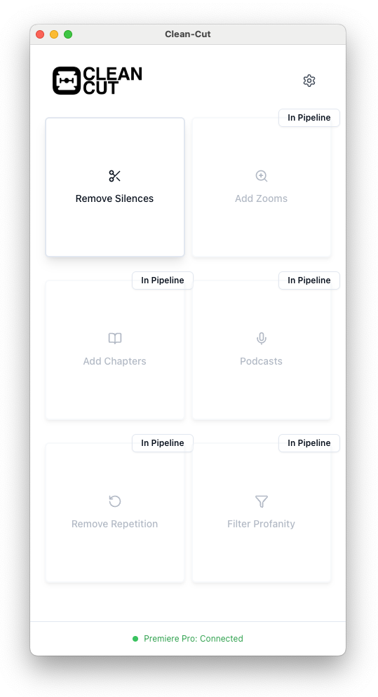

# Clean-Cut

Intelligent audio editing automation for Adobe Premiere Pro with silence detection, cutting, and other audio processing features. More tools in the pipeline.



## Prerequisites

- **Node.js** v22+
- **Python** 3.12+
- **Adobe Premiere Pro** 2025 (2022+ may work)
- **FFmpeg** (for frame decimation feature)

## Installation

### 1. Clone and Install

```bash
git clone "link to repo"
cd clean-cut
npm install
```

### 2. Python Setup

**macOS:**

```bash
cd python-backend
python3 -m venv .venv
source .venv/bin/activate
pip install -r requirements.txt
cd ..
```

**Windows:** (untested)

```cmd
cd python-backend
python -m venv .venv
.venv\Scripts\activate
pip install -r requirements.txt
cd ..
```

### 3. FFmpeg Installation

**macOS:**

```bash
# Using Homebrew (recommended)
brew install ffmpeg
```

**Windows:** (untested)

1. Download FFmpeg **Windows build** from [https://ffmpeg.org/download.html](https://ffmpeg.org/download.html) (choose "Windows builds by BtbN")
2. Extract the downloaded zip file to `C:\ffmpeg`
3. Add `C:\ffmpeg\bin` to your system PATH environment variable:
   - Open System Properties → Advanced → Environment Variables
   - Under "System variables", select "Path" and click "Edit"
   - Click "New" and add `C:\ffmpeg\bin`
   - Click "OK" to save
4. Restart Command Prompt/PowerShell and verify: `ffmpeg -version`

### 4. Premiere Pro Extension Setup

**macOS:**

```bash
sudo mkdir -p "/Library/Application Support/Adobe/CEP/extensions"
sudo ln -s "/path/to/your/clean-cut/premiere-extension" "/Library/Application Support/Adobe/CEP/extensions/com.cleancut.panel"
```

**Windows:** (untested - requires Administrator privileges)

1. **Run Command Prompt as Administrator**
2. Create the extensions directory and symlink:

```cmd
mkdir "C:\Program Files\Common Files\Adobe\CEP\extensions"
mklink /D "C:\Program Files\Common Files\Adobe\CEP\extensions\com.cleancut.panel" "C:\path\to\your\clean-cut\premiere-extension"
```

_Note: Replace `C:\path\to\your\clean-cut` with your actual project path. For newer Adobe versions, try `C:\Program Files\Common Files\Adobe\CEP\extensions` instead of the (x86) path._

### 5. Enable CEP Debugging

**macOS:**

```bash
defaults write com.adobe.CSXS.11 PlayerDebugMode 1
```

**Windows:** (untested)

**Run Command Prompt as Administrator** and execute:

```cmd
reg add "HKCU\Software\Adobe\CSXS.11" /v PlayerDebugMode /t REG_DWORD /d 1
```

_Note: The CSXS version number may vary based on your Premiere Pro version. Common versions: CSXS.9, CSXS.10, CSXS.11, CSXS.12_

### Video Installation Guide

For a detailed walkthrough of the installation process, check out my [installation guide video](https://youtu.be/EgkqhE5Rv_4).

[](https://youtu.be/EgkqhE5Rv_4 'Clean-Cut Installation Guide')

## Usage

1. Start the app: `npm run dev`
2. Open Premiere Pro with an active sequence
3. Go to **Window > Extensions > Clean-Cut**
4. Configure settings and process audio

## Troubleshooting

- **Extension not visible**: Verify symlink/link and restart Premiere Pro
- **Connection issues**: Ensure app is running (port 8085)

### Windows-Specific Issues

- **Python command not found**: Use `python` instead of `python3`, or try `py -3`
- **mklink permission denied**: Must run Command Prompt as Administrator
- **FFmpeg not found**: Ensure FFmpeg is properly added to PATH and restart terminal
- **CEP extension not loading**: Try different CSXS versions (9, 10, 11, 12) based on your Premiere Pro version
- **Administrator privileges**: Most Windows setup commands require running as Administrator

## License

MIT License - see [LICENSE](LICENSE) file.

---

**Note**: Developed and tested on macOS with Premiere Pro 2025. Windows compatibility not tested.
